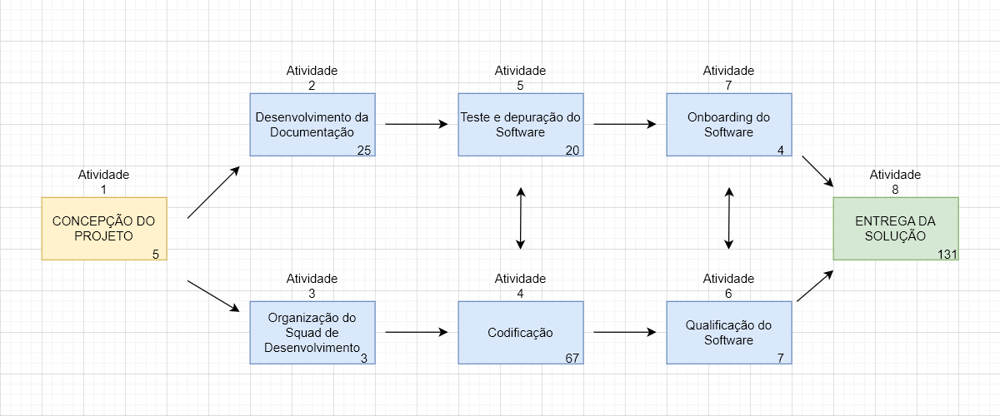
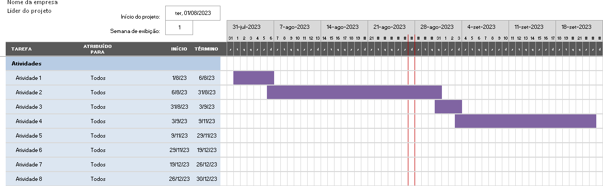
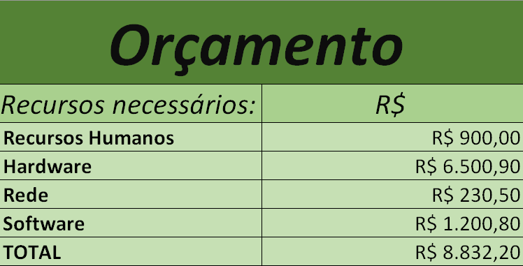

# Especificações do Projeto

Pré-requisitos: <a href="1-Documentação de Contexto.md"> Documentação de Contexto</a>

A definição exata do problema e os pontos mais relevantes a serem tratados neste projeto foi consolidada com a participação dos usuários em um trabalho de imersão feita pelos membros da equipe à partir da observação dos usuários em seu local natural e por meio de entrevistas. Os detalhes levantados nesse processo foram consolidados na forma de personas e histórias de usuários.

## Personas

|  | <h2 align="right"><b>Rafael Jr.</b></h2>    
Idade: 27   Descrição: O Rafael é um profissional que se desloca diariamente para o trabalho. Ele precisa saber o clima para se vestir adequadamente e planejar o tempo de viagem..  |
| --- | --- |
| Características Principais <ul><li>Profissional, prático, precisa economizar tempo.</li></ul>
Necessidades <ul><li>Previsões diárias, informações sobre temperatura, probabilidade de chuva.</li></ul> |

|  | <h2 align="right"><b>Ana Almeida</b></h2>    
Idade: 41   Descrição: A Ana é uma entusiasta de esportes ao ar livre e viagens. Ela está sempre em busca de informações precisas sobre o clima para planejar suas atividades, como trilhas, escaladas e acampamentos.  |
| --- | --- |
| Características Principais <ul><li>Aventureira, aventureira, proativa, impaciente.</li></ul>
Necessidades <ul><li> Previsões detalhadas por hora, possibilidade de modo escuro ou claro, alertas climáticos.</li></ul> |

## Histórias de Usuários

Com base na análise das personas forma identificadas as seguintes histórias de usuários:

|EU COMO... `PERSONA`| QUERO/PRECISO ... `FUNCIONALIDADE` |PARA ... `MOTIVO/VALOR`                 |
|--------------------|------------------------------------|----------------------------------------|
|Rafael Jr. | Previsões diárias | Para economizar tempo e estar sempre preparado para quaisquer condições climáticas. |
|Rafael Jr. | Informações sobre temperatura. | Para uma melhor escolha da vestimenta para o dia em questão. |
|Rafael Jr. | Probabilidade de chuva. | Para me resguardar com guarda-chuva ou capa de chuva em caso de possibilidade de chuva. |
|Ana Almeida| Previsões detalhadas por hora. | Permitir que eu me programe sem muita preocupação os afazeres do dia-a-dia. |
|Ana Almeida| Possibilidade de modo escuro ou claro. | Garantir conforto visual através do modo de visualização. |
|Ana Almeida| Alertas climáticos. | Para caso haja esquecimento de abrir o app, me seja enviado um alerta sobre o clima do dia. |

## Modelagem do Processo de Negócio 

### Análise da Situação Atual

Os usuários desejam obter informações meteorológicas específicas e personalizadas para planejar suas atividades diárias de forma mais eficiente, mas muitos aplicativos de clima oferecem apenas informações genéricas e não fornecem recomendações detalhadas com base no clima local e também não se comunica de forma mais "próxima" com o usuário, abordando as principais informações climáticas de acordo com o dialeto regional selecionado.

### Descrição Geral da Proposta

Limites e Desafios:

Precisão Meteorológica: A precisão das previsões meteorológicas ainda é um desafio, especialmente a longo prazo. Embora possamos acessar dados em tempo real e previsões confiáveis, eventos climáticos imprevisíveis podem ocorrer.

Integração de Dados: Garantir que os dados meteorológicos sejam consistentes e atualizados exige parcerias com fontes confiáveis. Manter essas integrações pode ser um desafio técnico e de negócios.

Personalização Excessiva: Oferecer muitas opções de personalização pode complicar a interface do usuário e sobrecarregar os usuários com escolhas. Encontrar o equilíbrio certo é crucial.

Variedade de Locais: Fornecer informações precisas para locais remotos ou pouco conhecidos pode ser um desafio, pois nem todos os lugares têm uma rede meteorológica robusta..

### Processo 1 – Escolha do estado

Processo ESCOLHA DE ESTADO, dado por um conjunto de ações feitas pelo usuário da aplicação para que seja retornado a ele o estado desejado. O usário consegue escolher o estado manualmente ou por meio de pesquisa do nome, caso o nome seja de um estado existente o usuário será capaz de selecioná-lo mais rapidamente ao invés de pesquisar por uma lista o estado desejado. Um ponto interessante de melhoria seria a capacidade de buscar o estado atual do usuário a partir do seu localizador móvel do seu smartphone.

### Processo 2 – NOME DO PROCESSO

Apresente aqui o nome e as oportunidades de melhorias para o processo 2. Em seguida, apresente o modelo do processo 2, descrito no padrão BPMN.

## Indicadores de Desempenho

Apresente aqui os principais indicadores de desempenho e algumas metas para o processo. Atenção: as informações necessárias para gerar os indicadores devem estar contempladas no diagrama de classe. Colocar no mínimo 5 indicadores. 

Usar o seguinte modelo: 

Obs.: todas as informações para gerar os indicadores devem estar no diagrama de classe a ser apresentado a posteriori. 

## Requisitos

As tabelas que se seguem apresentam os requisitos funcionais e não funcionais que detalham o escopo do projeto. 

### Requisitos Funcionais

|ID    | Descrição do Requisito  | Prioridade |
|------|-----------------------------------------|----|
|RF-001| Permitir que o usuário selecione as cidades em que ele deseja visualizar as informações de tempo e receber notificações | Alta
|RF-002| Permitir que o usuário visualize a previsão do tempo (temperatura, probabilidade de precipitação e níveis de umidade) do dia atual de acordo com a cidade selecionada pelo usuário | Alta
|RF-003| Notificar o usuário sobre alterações climáticas marcantes, como chuvas intensas, tempestades, etc. | Alta
|RF-004| Permitir que o usuário visualize a previsão do tempo (temperatura, probabilidade de precipitação e níveis de umidade) de cada dia da semana atual de acordo com a cidade selecionada pelo usuário | Média
|RF-005| Permitir que o usuário selecione o dialeto particular de uma das regiões brasileiras para exibição de informações, alertas e notificações. | Baixa | 
|RF-006| Permitir que o usuário selecione entre o tema claro e escuro do aplicativo. | Baixa |

### Requisitos não Funcionais

|ID     | Descrição do Requisito  |Prioridade |
|-------|-------------------------|----|
|RNF-001| Assegurar que os dados relacionados ao clima estejam atualizados de acordo com as últimas previsões disponíveis.  | Alta | 
|RNF-002| Apresentar tempos de carregamento eficientes e uma resposta rápida e fluída às ações dos usuários. | Alta | 
|RNF-003| Apresentar uma interface de usuário intuitiva e de fácil navegação. | Alta | 

## Restrições

O projeto está restrito pelos itens apresentados na tabela a seguir.

|ID| Restrição                                             |
|--|-------------------------------------------------------|
|01| O projeto deverá ser entregue até o final do semestre |
|02| Não pode ser desenvolvido um módulo de backend        |

## Diagrama de Casos de Uso

# Matriz de Rastreabilidade

# Gerenciamento de Projeto

De acordo com o PMBoK v6 as dez áreas que constituem os pilares para gerenciar projetos, e que caracterizam a multidisciplinaridade envolvida, são: Integração, Escopo, Cronograma (Tempo), Custos, Qualidade, Recursos, Comunicações, Riscos, Aquisições, Partes Interessadas. Para desenvolver projetos um profissional deve se preocupar em gerenciar todas essas dez áreas. Elas se complementam e se relacionam, de tal forma que não se deve apenas examinar uma área de forma estanque. É preciso considerar, por exemplo, que as áreas de Escopo, Cronograma e Custos estão muito relacionadas. Assim, se eu amplio o escopo de um projeto eu posso afetar seu cronograma e seus custos.

## Gerenciamento de Tempo

Com diagramas bem organizados que permitem gerenciar o tempo nos projetos, o gerente de projetos agenda e coordena tarefas dentro de um projeto para estimar o tempo necessário de conclusão.

O gráfico de Gantt ou diagrama de Gantt também é uma ferramenta visual utilizada para controlar e gerenciar o cronograma de atividades de um projeto. Com ele, é possível listar tudo que precisa ser feito para colocar o projeto em prática, dividir em atividades e estimar o tempo necessário para executá-las.

## Gerenciamento de Equipe

A gestão de tarefas e pessoas será feita através da ferramenta de projetos: [Quadro de Tarefas](https://github.com/orgs/ICEI-PUC-Minas-PMV-ADS/projects/502)

## Gestão de Orçamento

O processo de determinar o orçamento do projeto é uma tarefa que depende, além dos produtos (saídas) dos processos anteriores do gerenciamento de custos, também de produtos oferecidos por outros processos de gerenciamento, como o escopo e o tempo.

