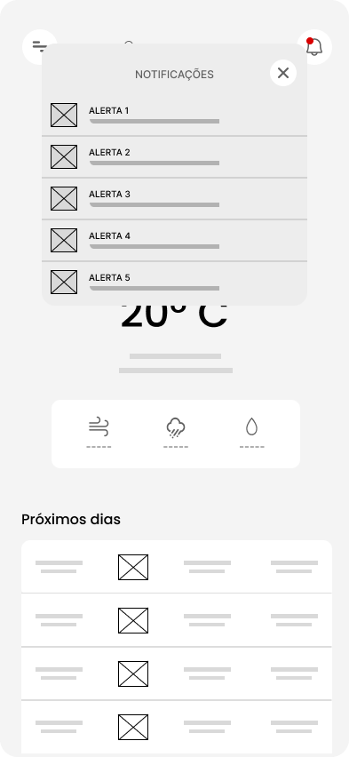

# Projeto de Interface

Pré-requisitos: <a href="2-Especificação do Projeto.md"> Documentação de Especificação</a>

Visão geral da interação do usuário pelas telas do sistema e protótipo interativo das telas com as funcionalidades que fazem parte do sistema (wireframes).

Com poucas telas, as interfaces foram projetadas de forma que , independente da faixa etária, os usuários utilizem todos os recursos que o app tem a oferecer, como visualizar as informações climáticas do local que pesquisar (ou sua localização atual), receber alertas de mudanças intensas do Clima e mudar o dialeto para que o APP seja diferente e divertido.

## Diagrama de Fluxo

As referências abaixo irão auxiliá-lo na geração do artefato “Diagramas de Fluxo”.

> **Links Úteis**:
> - [Fluxograma online: seis sites para fazer gráfico sem instalar nada | Produtividade | TechTudo](https://www.techtudo.com.br/listas/2019/03/fluxograma-online-seis-sites-para-fazer-grafico-sem-instalar-nada.ghtml)

## Wireframes

Este Wireframe representa a tela inicial do aplicativo UI Clima, onde o usuário pode selecionar o local que seja que irá exibir a temperatura atual, velocidade dos ventos, umidade, porcentagem de chance de precipitação, além da previsão dos próximos dias.

Tela de pesquisa de local 

Ao clicar no ícone de sino (notificações), o usuário poderá visualizar os alertas de clima para a região selecionada.

Clicando ícone do canto superior esquerdo (menu), pode-se visualizar as opções de escolha de tema, do dialeto desejado e os termos e condições

Página de seleção de Tema e de Dialeto

Fluxo de telas do aplicativo

Link do Figma: https://www.figma.com/file/8wZ1umCXSNboPnVecRYumE/UI-CLIMA---WIREFRAMES?type=design&node-id=0%3A1&mode=design&t=6CM8XV5fiCJ2tZSV-1

São protótipos usados em design de interface para sugerir a estrutura de um site web e seu relacionamentos entre suas páginas. Um wireframe web é uma ilustração semelhante do layout de elementos fundamentais na interface.
 
> **Links Úteis**:
> - [Protótipos vs Wireframes](https://www.nngroup.com/videos/prototypes-vs-wireframes-ux-projects/)
> - [Ferramentas de Wireframes](https://rockcontent.com/blog/wireframes/)
> - [MarvelApp](https://marvelapp.com/developers/documentation/tutorials/)
> - [Figma](https://www.figma.com/)
> - [Adobe XD](https://www.adobe.com/br/products/xd.html#scroll)
> - [Axure](https://www.axure.com/edu) (Licença Educacional)
> - [InvisionApp](https://www.invisionapp.com/) (Licença Educacional)
